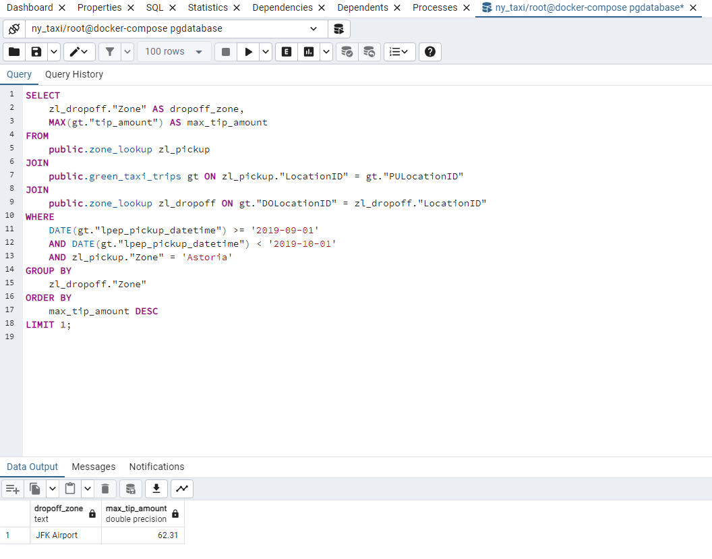

# Homework - Week 01
--------

## Environment Setup

### 1. Run the docker-compose.yaml file

`docker-compose up`

### 2. Build the docker image from homework.Dockerfile

`docker build -f homework.Dockerfile -t homework:v001 .`

### 3. Start the container with the image built in step 2 to ingest the data into the database

```
docker run -it \
    homework:v001 \
    --user=root \
    --password=root \
    --host=host.docker.internal \
    --port=5432 \
    --db=ny_taxi \
    --table_names=green_taxi_trips,zone_lookup \
    --urls=https://github.com/DataTalksClub/nyc-tlc-data/releases/download/green/green_tripdata_2019-09.csv.gz,https://s3.amazonaws.com/nyc-tlc/misc/taxi+_zone_lookup.csv
```

---------------------

### Q1. Which tag has the following text? - _Automatically remove the container when it exits_

#### Answer: --rm

`docker run --help`

Solution screenshot: 


### Q2. What is version of the package wheel ?

#### Answer: 0.42.0

`docker build -f q2.Dockerfile -t homework-q2:v001 .`

`docker run -it homework-q2:v001`

In the opened prompt:

`pip list`

Solution screenshot: 


### Q3. How many taxi trips were totally made on September 18th 2019?

#### Answer: 15612

In pgAdmin SQL interface:
```
SELECT COUNT(*)
FROM public.green_taxi_trips
WHERE 
    lpep_pickup_datetime >= '2019-09-18 00:00:00' 
    AND lpep_pickup_datetime < '2019-09-19 00:00:00'
    AND lpep_dropoff_datetime >= '2019-09-18 00:00:00' 
    AND lpep_dropoff_datetime < '2019-09-19 00:00:00';
```

Solution screenshot: 


### Q4. Which was the pick up day with the largest trip distance? Use the pick up time for your calculations.

#### Answer: 2019-09-26

In pgAdmin SQL interface:
```
SELECT
    DATE(lpep_pickup_datetime) AS pickup_day,
    MAX(trip_distance) AS max_trip_distance
FROM
    public.green_taxi_trips
GROUP BY
    DATE(lpep_pickup_datetime)
ORDER BY
    max_trip_distance DESC
LIMIT 1;
```

Solution screenshot: 


### Q5. Consider lpep_pickup_datetime in '2019-09-18' and ignoring Borough has Unknown. Which were the 3 pick up Boroughs that had a sum of total_amount superior to 50000?

#### Answer: Brooklyn, Manhattan, Queens

In pgAdmin SQL interface:

```
SELECT
    t1."Borough",
    SUM(t2."total_amount") AS total_amount_sum
FROM
    public.zone_lookup t1
JOIN
    public.green_taxi_trips t2 ON t1."LocationID" = t2."PULocationID"
WHERE
    DATE(t2."lpep_pickup_datetime") = '2019-09-18'
    AND t1."Borough" != 'Unknown'
GROUP BY
    t1."Borough"
HAVING
    SUM(t2."total_amount") > 50000
ORDER BY
    total_amount_sum DESC
LIMIT 3;
```

Solution screenshot: 


### Q6. For the passengers picked up in September 2019 in the zone name Astoria which was the drop off zone that had the largest tip? We want the name of the zone, not the id.

#### Answer: JFK Airport

In pgAdmin SQL interface:

```
SELECT
    zl_dropoff."Zone" AS dropoff_zone,
    MAX(gt."tip_amount") AS max_tip_amount
FROM
    public.zone_lookup zl_pickup
JOIN
    public.green_taxi_trips gt ON zl_pickup."LocationID" = gt."PULocationID"
JOIN
    public.zone_lookup zl_dropoff ON gt."DOLocationID" = zl_dropoff."LocationID"
WHERE
    DATE(gt."lpep_pickup_datetime") >= '2019-09-01'
    AND DATE(gt."lpep_pickup_datetime") < '2019-10-01'
    AND zl_pickup."Zone" = 'Astoria'
GROUP BY
    zl_dropoff."Zone"
ORDER BY
    max_tip_amount DESC
LIMIT 1;
```

Solution screenshot: 




### Q7. Preparing environment using Terraform


Output of `terraform apply`:

```
jaypatel@Moomin:~/projects/Data Engineering/Data-Engineering-Zoomcamp-Homework/module-01-homework/terraform/terraform_with_variables$ terraform apply

Terraform used the selected providers to generate the following execution plan. Resource actions are indicated with the following symbols:
  + create

Terraform will perform the following actions:

  # google_bigquery_dataset.demo_dataset will be created
  + resource "google_bigquery_dataset" "demo_dataset" {
      + creation_time              = (known after apply)
      + dataset_id                 = "demo_dataset_jp"
      + default_collation          = (known after apply)
      + delete_contents_on_destroy = false
      + effective_labels           = (known after apply)
      + etag                       = (known after apply)
      + id                         = (known after apply)
      + is_case_insensitive        = (known after apply)
      + last_modified_time         = (known after apply)
      + location                   = "US"
      + max_time_travel_hours      = (known after apply)
      + project                    = "dtc-de-course-412115"
      + self_link                  = (known after apply)
      + storage_billing_model      = (known after apply)
      + terraform_labels           = (known after apply)
    }

  # google_storage_bucket.demo-bucket will be created
  + resource "google_storage_bucket" "demo-bucket" {
      + effective_labels            = (known after apply)
      + force_destroy               = true
      + id                          = (known after apply)
      + location                    = "US"
      + name                        = "terraform-demo-terra-bucket-jp"
      + project                     = (known after apply)
      + public_access_prevention    = (known after apply)
      + self_link                   = (known after apply)
      + storage_class               = "STANDARD"
      + terraform_labels            = (known after apply)
      + uniform_bucket_level_access = (known after apply)
      + url                         = (known after apply)

      + lifecycle_rule {
          + action {
              + type = "AbortIncompleteMultipartUpload"
            }
          + condition {
              + age                   = 1
              + matches_prefix        = []
              + matches_storage_class = []
              + matches_suffix        = []
              + with_state            = (known after apply)
            }
        }
    }

Plan: 2 to add, 0 to change, 0 to destroy.

Do you want to perform these actions?
  Terraform will perform the actions described above.
  Only 'yes' will be accepted to approve.

  Enter a value: yes

google_bigquery_dataset.demo_dataset: Creating...
google_storage_bucket.demo-bucket: Creating...
google_bigquery_dataset.demo_dataset: Creation complete after 1s [id=projects/dtc-de-course-412115/datasets/demo_dataset_jp]
google_storage_bucket.demo-bucket: Creation complete after 1s [id=terraform-demo-terra-bucket-jp]

Apply complete! Resources: 2 added, 0 changed, 0 destroyed.

```

Screenshots:


